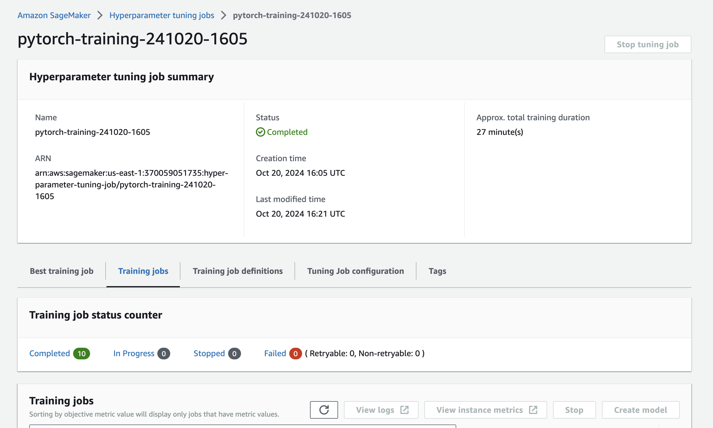
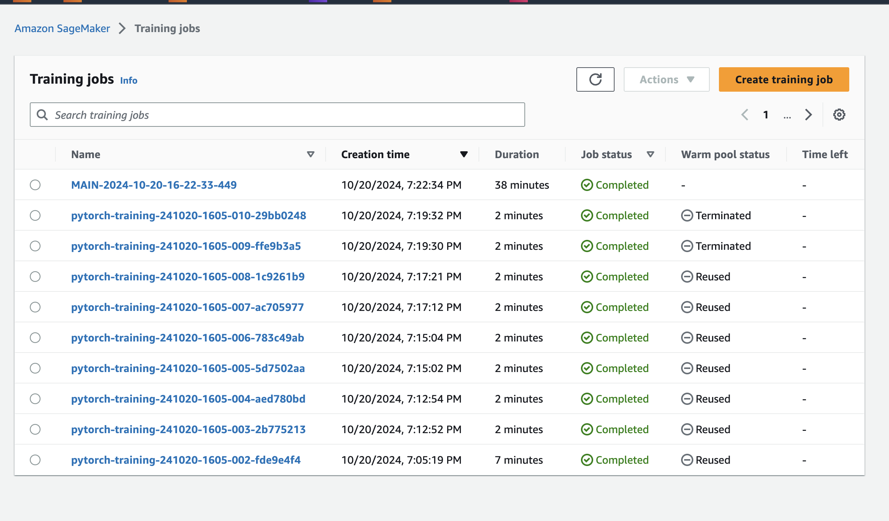
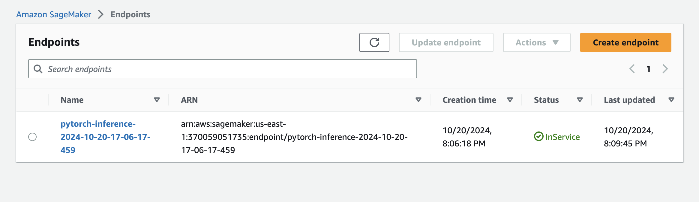

# Image Classification using AWS SageMaker  

This project demonstrates how to use **AWS SageMaker** to train a pretrained model for image classification, applying best ML engineering practices. The project includes profiling, debugging, hyperparameter tuning, and model deployment.

---

## Project Setup and Installation  

1. Access AWS through the course’s gateway and open **SageMaker Studio**.  
2. Download the starter files.  
3. Prepare the dataset (either the provided dog breed dataset or another relevant dataset).  

---

## Dataset Preparation  

- **Primary Dataset**: Dog breed classification dataset.
- **Alternative**: You can use any dataset that suits your goals.  
- **Data Access**: Upload the dataset to an **S3 bucket** to allow SageMaker access.

---

## Hyperparameter Tuning  

Using **ResNet50**, we optimized hyperparameters with the `hpo.py` script to achieve better performance.  

- **Learning Rate**: Range between **0.001 to 0.1**.  
- **Batch Size**: Chosen from **16, 32, 64, 128, 256, 512**.  

After finding the best combination, the model was trained for **20 epochs**.

---

## Training the Model  

We trained the model using `train.py` with the best hyperparameters from tuning. After **20 epochs**, the model achieved an accuracy of **79.18%**.

---

## Debugging and Profiling  

### Debugging  

- Used **SageMaker Debugger** (`smdebug` library) to monitor tensor values during training.  
- Registered **SMDebug hooks** for both training and evaluation phases.  
- Configured **rules** and parameters in `train_and_deploy.ipynb` to track metrics.
- Anomalies identified through **CloudWatch logs** were resolved by code adjustments.

### Profiling  

- Monitored **CPU/GPU utilization** and memory usage using **SageMaker Profiler**.
- Generated a **HTML report** with insights into resource usage.  
- The report indicated **GPU underutilization**, suggesting batch size increase or a smaller instance type.

---

## Training Insights  

- **Training Time**: ~38 minutes.  
- **GPU Utilization**: Low, requiring tuning for better efficiency.

---

## Model Deployment  

The trained model is a **PyTorch CNN** based on **ResNet50**, with a fully connected layer of **133 output classes** for the dog breeds.

- **Best Hyperparameters**:  
  - Learning Rate: **0.0022429783587920764**  
  - Batch Size: **64**  
  - Early Stopping: **15 rounds**

### Deployment Code  

from sagemaker.predictor import Predictor

predictor = Predictor('pytorch-inference-2024-10-20-17-06-17-459', 
                      sagemaker_session=sagemaker_session)

